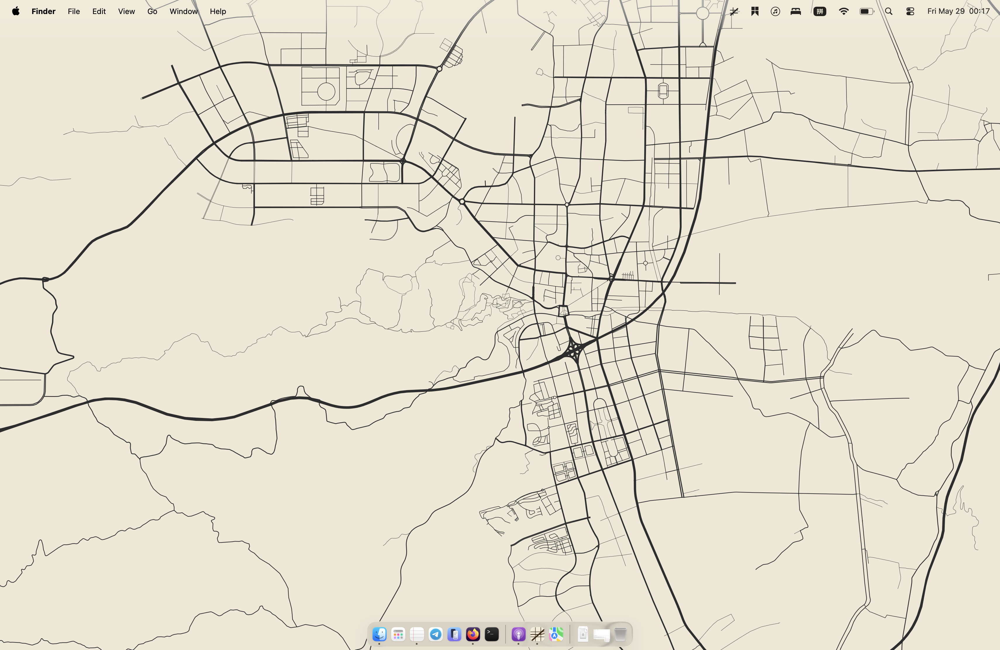
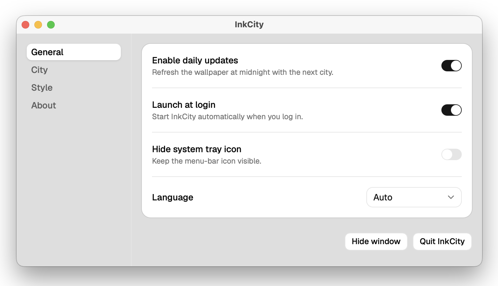

  
  <h1>InkCity</h1>
  
Your desktop wallpaper, redrawn every day as the road map of a different city.

---

InkCity is a small cross-platform (macOS + Windows) desktop app. Every day at midnight it picks a city, renders its road network as an ink-on-paper map sized to your screen, and sets it as your wallpaper.

## Installation

Open https://github.com/RalfZhang/ink-city/releases/latest/
- For windows: download `InkCity_x.x.x_x64-setup.exe ` and run the installer.
- macOS: download `InkCity_x.x.x_universal.dmg `, open it, and drag the app to your Applications folder.

## Features

- **A new city every day** — a deterministic rotation through the world's ~1000 most populous cities.
- **Real road data** — road geometry from OpenStreetMap, rendered to cover-fit your screen without stretching.
- **Themeable maps** — Light / Dark / Follow-system map palettes, each with customizable background and line colors, plus three line-weight presets (Minimal / Standard / Bold).

## Screenshots

  
  

## Data sources & licenses

- Road map data © **OpenStreetMap** contributors, licensed under the [Open Database License (ODbL)](https://opendatacommons.org/licenses/odbl/).
- City list from [**GeoNames**](https://www.geonames.org/), licensed under [CC BY 4.0](https://creativecommons.org/licenses/by/4.0/).

These attributions are also shown in the app's **About** tab.

## Feedback

Found a bug or have an idea? [Open an issue](https://github.com/RalfZhang/ink-city/issues). For bug reports, please include your OS version and, if relevant, the city/date that triggered the problem.

## License

InkCity's own source code is released under the [MIT License](LICENSE). The data it displays is licensed separately, as described above.
